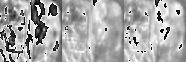
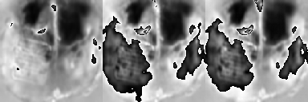
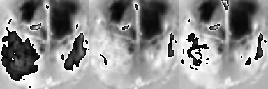
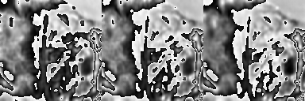
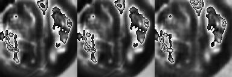

# VPTR for CSD Detection
This repository contains code for using the implementation of the Video Predictive Transformer (VPTR) model to detect Cortical Spreading Depression (CSD) events from raw calcium imaging data. The code is adapted from the following implementation of the paper https://github.com/XiYe20/VPTR#vptr-efficient-transformers-for-video-prediction. In the gif below the left block is the true past frames, the middle block the reconstructed past frames and the right block the reconstructed future frames.



## Installation & Set-up
1. Clone the repository:  
```
git clone https://github.com/CynicalDaud/vptr.git
```
2. Navigate to the repository
3. Install the required packages with: 
```python
pip install -r requirements.txt
```

## Dataset
We assume the structure of the dataset directory is as follows. However the data loader classes were designed to work by recursively searching suub-directories. Mappings for the train, test & validation splits are produced internally so the user only needs to pass in the parent directory as an argument.

    MCS/
    ├── Normalized
        ├── 20008034/
        │   ├── video_001.tiff
        │   ├── video_002.tiff
        │   ├── ...
        │   └── video_100.tiff
        ├── 20008035/
        │   ├── video_101.tiff
        │   ├── video_102.tiff
        │   ├── ...
        │   └── video_120.tiff
        └── ...


The Data Loader is initiallised with the following default parameters in dataset.py:  
```python
get_data(batch_size = 1,  
            data_set_dir = 'MCS/', 
            ngpus = 1, 
            num_workers = 1, 
            num_frames = 20, 
            video_limit = None,
            split_ratio = 0.5)
```
The list of parameters are as follows:

* **batch_size** - The number of video sequences per batch to be used in training or testing.
* **data_set_dir** - The directory path where the dataset is stored.
* **ngpus** - The number of GPUs to use for parallel processing of the data.
* **num_workers** - The number of subprocesses to use for data loading.
* **num_frames** - The number of frames to include in each sample
* **video_limit** - The range of each video to extract samples from. E.g. setting video_limit = 1000 and num_frames = 100 will store pointers to 10 samples from each video that are loaded into memory during training.
* **split_ratio** - The ratio of past:future frames in each sample. E.g. using split_ratio = 0.75 when num_frames = 100 will use the first 75 frames as past frames, followed by the next 25 as future frames.


A template file is provided to run tests on the dataset. This works by loading each video into memory and printing a tiffile warning next to the name of the corresponding file. Users can add additional tests as the data is being loaded in. Run this with:

```python
python test_dataset.py
```


## Training Auto-Encoder
Training our model is done in two parts - first traning the autoencoder and then using these saved checkpoints to train the transformer. Update the file paths of the working_dir and the results_dir in train_AutoEncoder.py before running the training file with:

```python
python train_AutoEncoder.py
```

The model itself can be modified by changing the following parameters, where:

* **img_c** - Number of channels in the input image. Default is 1 (for grayscale images).
* **feat_dim** - Dimension of the feature vector used in the network. 
* **n_downsampling** - Number of downsampling layers in the network.
* **out_layer** - Activation function used in the model. Can be one of ReLU, Sigmoid, Tanh, SiLU, ELU, SELU, but the user can also add their own in ResNetAutoEncoder.py 

```python
VPTREnc(img_channels = 1, 
            feat_dim = 256, 
            n_downsampling = 3)

VPTRDec(img_channels = 1, 
            feat_dim = 256, 
            n_downsampling = 3,
            out_layer = 'ReLU')

VPTR_Disc(img_channels = 1, 
            feat_dim = 256, 
            n_downsampling = 3,
            norm_layer= nn.BatchNorm2d)
            
init_weights(model = VPTR_Enc, init_type='xavier')
```

This will train the Autoencoder to learn the feature space of the input samples and reconstruct these into accurate frames. Visualisations and model weights are saved at user defined intervals with the following results direcotry structure:

    Trained_AE/
    ├── Tensorboard/
    ├── Test_gifs_epoch1/
        ├── ae_clip_0.gif
        ├── ae_clip_1.gif
        ├── ...
    ├── ...
    ├── Train_gifs_epoch1
        ├── ae_clip_0.gif
        ├── ae_clip_1.gif
        ├── ...
    ├── Model_checkpoints/
        ├── epoch1.tar
        ├── ...

## Training Transformer
To train the transformer update the results_dir to be somewhere different to the one used for the AutoEncoder. Then set the resume_AE_dir to point to where the trained autoencoder checkpoints are. The Transformer can be modified with the following parameters:

```python
VPTRFormerNAR(num_past_frames=10, num_future_frames=16, encH=16, encW = 528
                d_model=encC, nhead=8, num_encoder_layers=4, num_decoder_layers=4
                dropout=0.1, window_size=4, Spatial_FFN_hidden_ratio=4)
```

* **num_past_frames** - number of past frames to be trained on
* **num_future_frames** - number of future frames to predict
* **encH** - an integer representing the height of the encoded frames
* **encW** - an integer representing the width of the encoded frames
* **d_model** - an integer representing the number of expected features in the input
* **nhead** - an integer representing the number of heads in the multihead attention layer
* **num_encoder_layers** - an integer representing the number of encoder layers in the transformer
* **num_decoder_layers** - an integer representing the number of decoder layers in the transformer
* **dropout** - a float representing the dropout probability in the transformer
* **window_size** - an integer representing the size of the sliding window
* **Spatial_FFN_hidden_ratio** - an integer representing the ratio of hidden units to input units in the spatial feedforward network

This will train the Transformer to to predict the features of future frames given an encdoed feature space of past frames. The decoder then reconstructs these as the frames shown below in the Results section. Visualisations and model weights are saved at user defined intervals with the following results direcotry structure:

    Trained_Transformer/
    ├── Tensorboard/
    ├── Test_gifs_epoch1/
        ├── ae_clip_0.gif
        ├── ae_clip_1.gif
        ├── ...
    ├── ...
    ├── Train_gifs_epoch1
        ├── ae_clip_0.gif
        ├── ae_clip_1.gif
        ├── ...
    ├── Model_checkpoints/
        ├── epoch1.tar
        ├── ...


## Results
### Autoencoder
The results of training an autoencoder on 100 frames (50 past, 50 future) are shown below. The left block are the past frames, the middle the reconstructed past frames and the right the reconstructed future frames.

Epoch 5  

  
  
Epoch 10  

  
  
Epoch 15  

  
  
### Transformer
The results of the transformer are shown below. Here the left block is the true set of past frames, the middle block the true set of future frames and the right block is the predicted future frames. Effectively we want to compare the middle and right blocks to see how well the transformer learns to predict movements.  
  
Test run  



The above result is from a test run when the transformer was trained on 2 videos so it began to overfit. Below are shown examples from training on the whole dataset where the transformer begins to predict static frames.

Epoch 5 - This is a similar example to the test run above, but the transformer's performance is slighlty worse as it is generalizing after training on the whole dataset.  



Epoch 10  

  
  
Epoch 15  

  
  